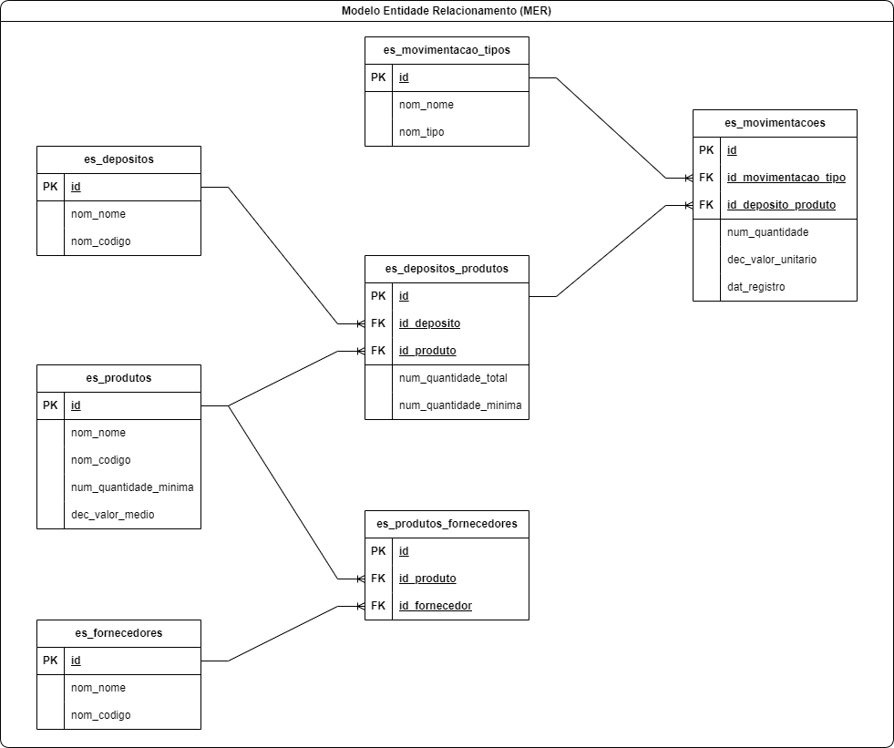

# Sobre o projeto

O projeto Stock Services é um conjunto de rotas que realizam ações específicas e umm banco de dados Oracle de nosso Estoque, como por exemplo:

* Cadastro de depósitos
* Cadastro de produtos
* Cadastro de fornecedores
* Movimentação de produtos entre depósitos

A relação detalhada das rotas pode ser vista nesta documentação:

* [Exemplos de Requisições](./exemplos_de_requisicoes.md)

## Sobre o banco de dados

Este é o diagrama de Entidade X Relacionamento (MER) do banco de dados Oracle de nosso Estoque:

E este é um script para criar os elementos do banco + uma massa de dados:

* [Script para gerar massa de dados](./script_para_gerar_dados.sql)
